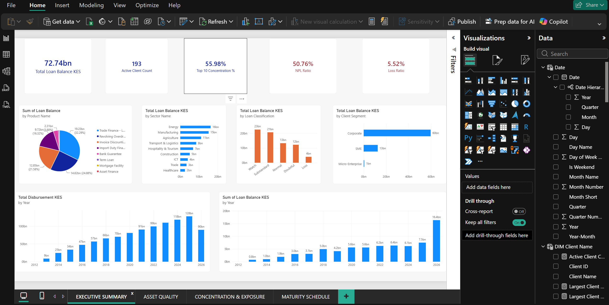
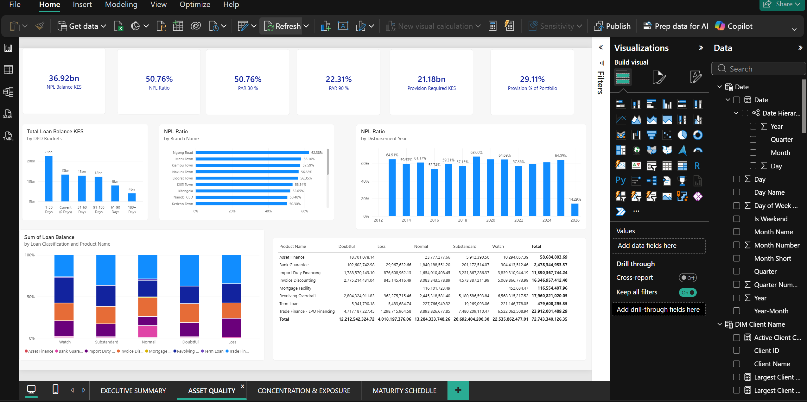
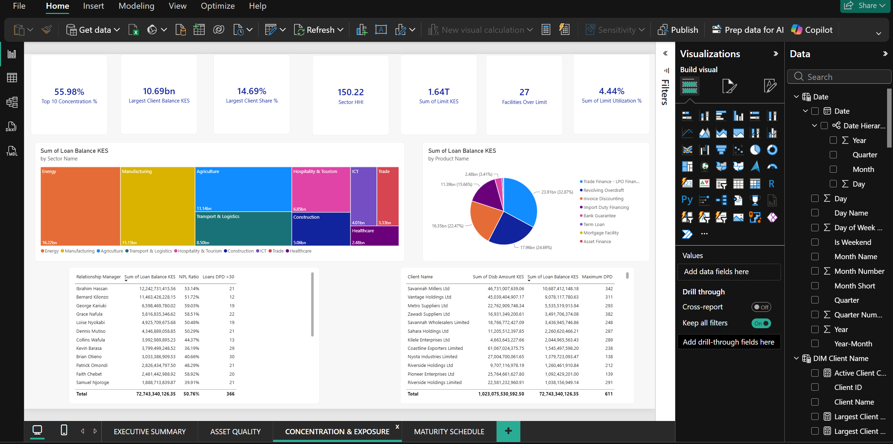
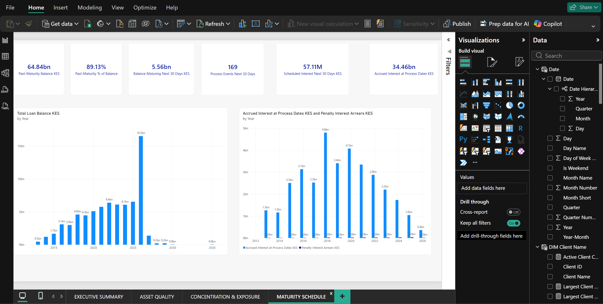

# Commercial Loan Portfolio & Credit Risk Analytics

## Project Overview

This project demonstrates the development of an interactive Commercial Loan Portfolio and Credit Risk Analytics solution using a fictional commercial lending dataset.

The dashboard was designed to provide management-level visibility into portfolio performance, credit quality, concentration risk, maturity exposure and business performance.

The project combines credit analysis, financial data analysis and business intelligence techniques to transform lending data into actionable portfolio insights.

## Key Areas of Analysis

### Portfolio Performance

* Total Loan Portfolio
* Loan Disbursements
* Portfolio Growth
* Portfolio Balance by Product
* Portfolio Balance by Sector
* Portfolio Vintage Analysis

### Credit Risk Analytics

* Portfolio at Risk (PAR 30)
* Portfolio at Risk (PAR 90)
* Non-Performing Loans (NPL)
* Loan Classification
* Provision Required
* Provision as % of Portfolio
* Days Past Due (DPD) Analysis

### Portfolio Concentration Risk

* Largest Client Share
* Sector Concentration
* Sector HHI
* Product Concentration
* Facilities Over Limit
* Exposure by Sector

### Maturity & Pipeline Analysis

* Past-Maturity Balance
* Past-Maturity %
* Balance Maturing Within 30 Days
* Process Events Within 30 Days
* Scheduled Interest Within 30 Days
* Remaining Maturity
* Accrued Interest

### Business Performance

* Portfolio by Relationship Manager
* Disbursements by Relationship Manager
* Portfolio Risk by Relationship Manager
* Product Performance
* Sector Performance

## Dashboard

### Executive Summary



### Asset Quality



### Concentration & Exposure



### Maturity Schedule



## Tools & Technologies

* Power BI
* DAX
* Microsoft Excel
* SQL
* Data Modelling
* Credit Risk Analytics
* Business Intelligence

## Project Structure

```text
commercial-loan-portfolio-powerbi/
│
├── screenshots/
│   ├── 01-executive-summary.png
│   ├── 02-asset-quality.png
│   ├── 03-concentration-exposure.png
│   └── 04-maturity-schedule.png
│
├── dax/
│
├── sql/
│
├── data/
│
└── README.md
```

## Dataset

The project uses a fictional commercial lending dataset created specifically for portfolio analytics and business intelligence demonstration purposes.

The dataset is designed to simulate a commercial lending portfolio containing information used for portfolio monitoring, credit-risk assessment, concentration analysis and maturity management.

[Download the Commercial Loan Portfolio Dataset](data/commercial-loan-portfolio-data.xlsx)

No confidential customer, account or company information is used.

## Credit Risk Metrics

The dashboard incorporates several credit-risk and portfolio-management measures, including:

| Metric                | Purpose                                                     |
| --------------------- | ----------------------------------------------------------- |
| Total Loan Portfolio  | Measures overall outstanding portfolio exposure             |
| PAR 30                | Identifies portfolio exposure past due by more than 30 days |
| PAR 90                | Identifies severely delinquent portfolio exposure           |
| NPL                   | Measures non-performing credit exposure                     |
| Loan Classification   | Groups facilities according to credit-risk status           |
| Provision Required    | Estimates required credit-loss provisions                   |
| Provision %           | Measures provision requirements relative to portfolio       |
| DPD                   | Measures delinquency levels                                 |
| Largest Client Share  | Measures single-obligor concentration                       |
| Sector HHI            | Measures sector concentration risk                          |
| Facilities Over Limit | Identifies facilities exceeding approved limits             |
| Past-Maturity Balance | Identifies exposure beyond contractual maturity             |
| Maturity Pipeline     | Highlights upcoming portfolio maturities                    |

## Key Skills Demonstrated

* Commercial credit analysis
* Credit risk analytics
* Portfolio monitoring
* Financial data analysis
* Data cleaning and transformation
* Data modelling
* DAX measure development
* Power BI dashboard development
* KPI development
* Portfolio concentration analysis
* Maturity analysis
* Management reporting
* Business intelligence
* SQL analysis
* Financial reporting

## Business Questions Addressed

The dashboard is designed to help answer questions such as:

* What is the current size of the loan portfolio?
* How is the portfolio performing over time?
* What proportion of the portfolio is exposed to PAR 30 and PAR 90?
* How much of the portfolio is classified as NPL?
* Which sectors have the highest exposure?
* How concentrated is the portfolio?
* Which clients represent the largest exposures?
* Are any facilities above their approved limits?
* How much exposure has passed maturity?
* How much of the portfolio is maturing within the next 30 days?
* How is portfolio performance distributed across Relationship Managers?
* Which products contribute the largest portfolio exposure?
* What level of provision is required based on loan classification?

## Disclaimer

This project is for portfolio analytics, business intelligence and demonstration purposes only.

The data is fictional and does not represent the actual portfolio, customers, financial position or performance of any real financial institution.

## Author

**Elvas Maribong Kurgat**

Credit Analyst | Business Intelligence Analyst | Credit Risk Analytics

Kenya
